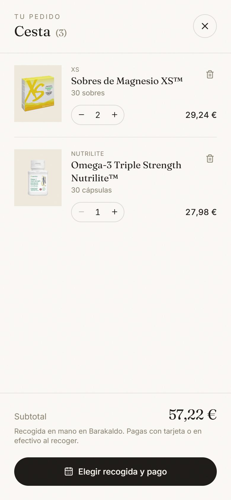
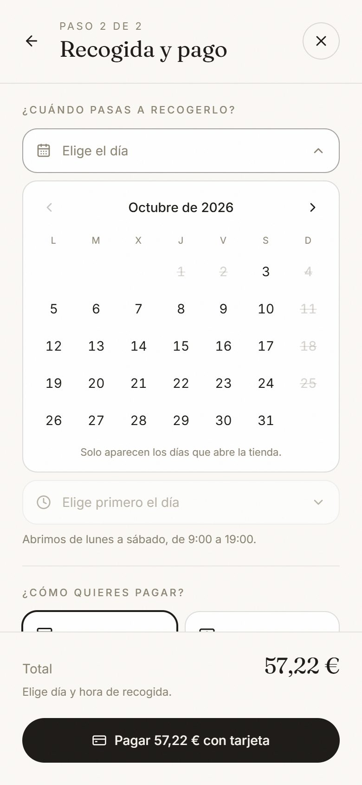
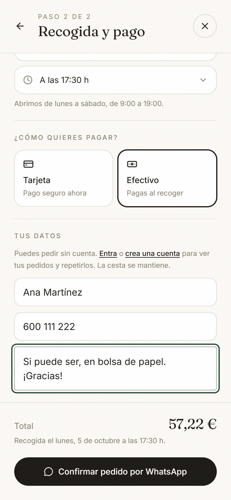
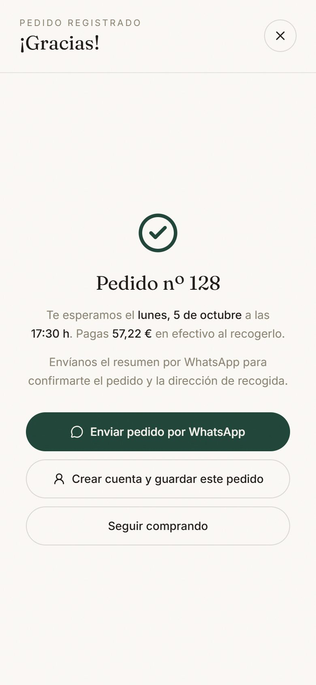
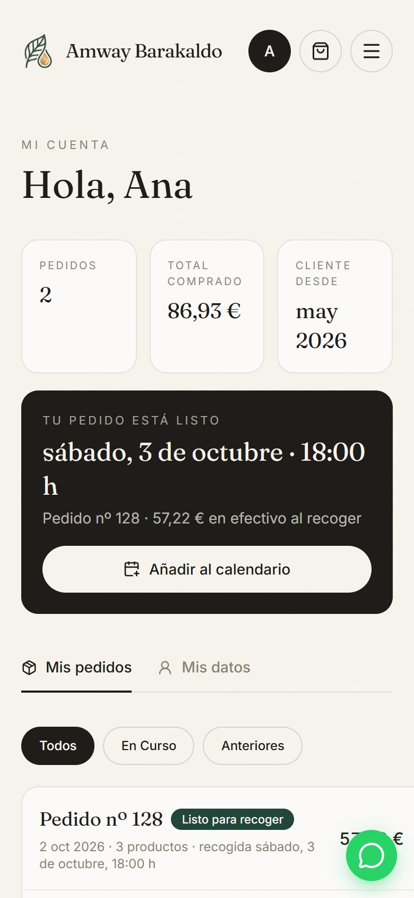
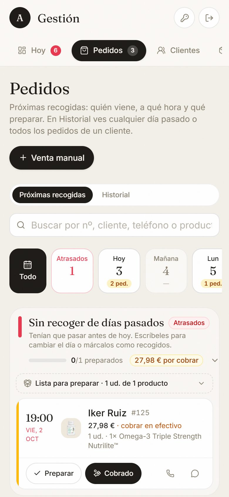
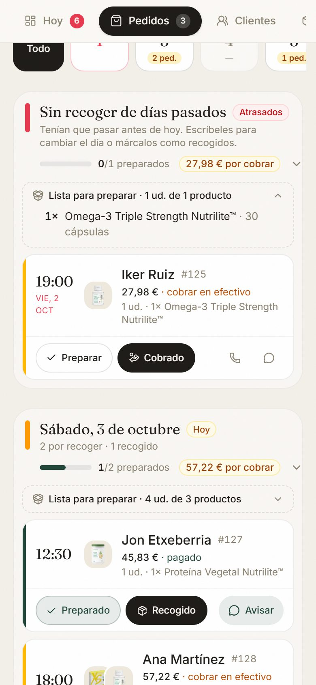
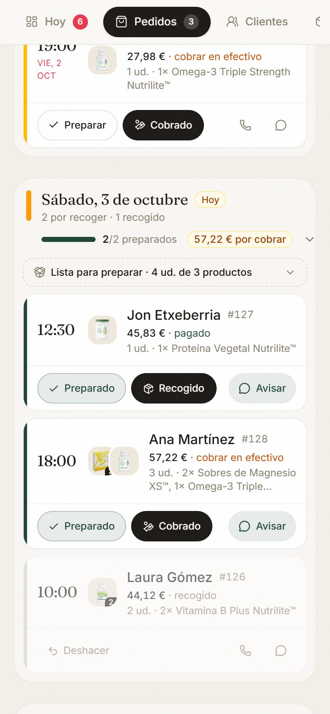
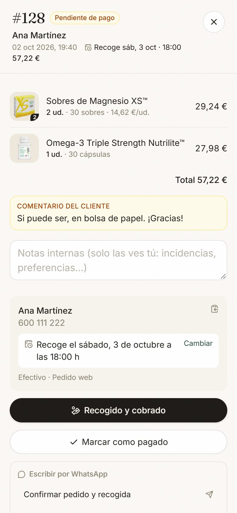
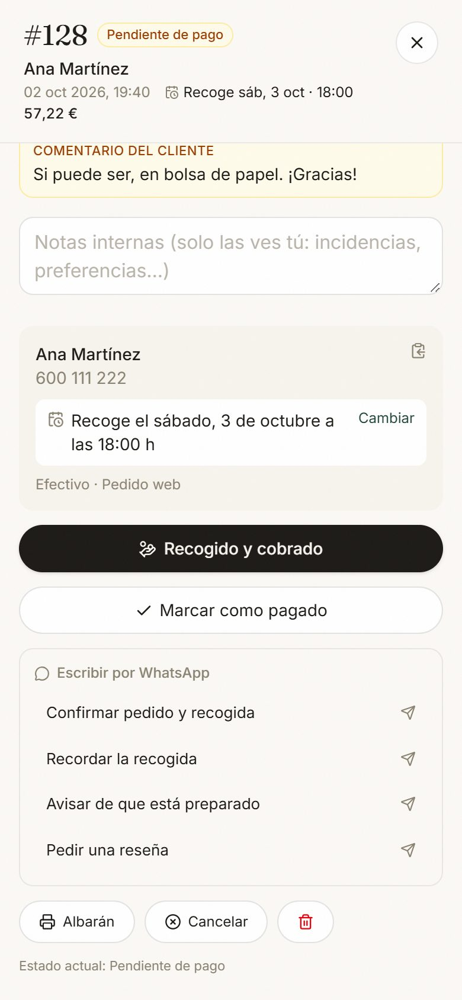

# Cómo funciona un pedido

Recorrido completo de un pedido de la web, de principio a fin: lo que ve el cliente, lo que ve Yuly en el panel de gestión y lo que pasa por detrás. Las capturas son del móvil y usan pedidos de ejemplo (no son clientes reales).

**En resumen:** el cliente elige productos, día y hora de recogida y cómo paga (tarjeta ahora o efectivo al recoger). A Yuly le llega un aviso al móvil, prepara la bolsa, avisa al cliente por WhatsApp y, cuando pasa a recogerlo, lo marca como recogido (y cobrado, si era en efectivo).

---

## 1. Lo que ve el cliente

### Paso 1 · La cesta



Añade productos desde el catálogo y ajusta las cantidades. Si un producto se agota mientras lo tiene en la cesta, aparece en rojo («Agotado · quítalo para continuar») y no puede seguir hasta quitarlo.

### Paso 2 · Día y hora de recogida



- Solo se pueden pulsar los días que abre la tienda (los domingos salen tachados).
- Las horas van de media en media hora, dentro del horario de 9:00 a 19:00.
- Si es para hoy, la hora tiene que quedar al menos a 1 hora vista, para que dé tiempo a prepararlo.
- Se puede reservar hasta con 60 días de antelación.

### Paso 3 · Forma de pago y datos



- **Tarjeta:** paga en ese momento en la pantalla segura de Stripe (tarjeta, Apple Pay, Google Pay, Bizum…).
- **Efectivo:** paga al recoger.
- Nombre y teléfono son obligatorios (se recuerdan para la próxima vez). El comentario es opcional: Yuly lo ve destacado en la ficha del pedido.
- No hace falta cuenta para pedir. Si tiene cuenta, sus datos salen ya rellenos.

### Paso 4 · Pedido registrado



- **En efectivo:** ve el nº de pedido, el día y la hora, y cuánto pagará. Se le abre WhatsApp con el resumen ya escrito para mandárnoslo.
- **Con tarjeta:** al volver de Stripe ve «¡Gracias por tu pedido!» con el **nº de pedido** y el botón para enviar el resumen por WhatsApp.
- Sin cuenta, puede crearla en ese momento y guardar el pedido en ella.

Ejemplo del mensaje de WhatsApp que nos llega:

> Hola, buenas:
>
> Acabo de realizar un pedido en la web. Os dejo el resumen:
>
> **Pedido nº 128**
>
> **Productos**
> • 2 × Sobres de Magnesio XS™ (30 sobres) — 29,24 €
> • 1 × Omega-3 Triple Strength Nutrilite™ (30 cápsulas) — 27,98 €
>
> **Total: 57,22 €**
>
> **Recogida:** Lunes, 5 de octubre, a las 17:30 h
> **Forma de pago:** Efectivo, en el momento de la recogida
> **Nombre:** Ana Martínez
> **Teléfono:** 600 111 222
> **Comentarios:** Si puede ser, en bolsa de papel. ¡Gracias!
>
> ¿Me confirmáis el pedido y la dirección de recogida? Muchas gracias.

### Después · «Mi cuenta»



Si tiene cuenta, ve sus pedidos y en qué punto está cada uno:

| Estado que ve el cliente | Qué significa |
|---|---|
| Confirmado · pagas al recoger | Pedido en efectivo recibido; aún no está preparado |
| Pagado · en preparación | Pagado con tarjeta; aún no está preparado |
| **Listo para recoger** | Yuly ha marcado la bolsa como preparada |
| Recogido | Ya se lo ha llevado |
| Cancelado | Anulado |

Desde aquí puede **repetir el pedido**, añadir la recogida a su calendario, escribirnos por WhatsApp o **cancelarlo** (solo si es en efectivo y todavía no está preparado). Si pidió sin cuenta, puede añadirlo después a su cuenta con el nº de pedido y su teléfono.

---

## 2. Lo que ve Yuly (panel de gestión)

### Llega el aviso

En cuanto entra un pedido, le llega una notificación al móvil, por ejemplo:

> 🛍️ **Pedido #128 · paga en efectivo**
> Ana Martínez · 3 ud. · 57,22 € · Recoge lun 5 oct a las 17:30

o, si ha pagado con tarjeta: «💳 Pedido #129 pagado con tarjeta». Al tocarla se abre ese pedido en el panel.

### La agenda de recogidas



**Pedidos → Próximas recogidas** reúne en un solo sitio todo lo que hay que preparar:

- **Tira de días** con cuántos pedidos hay cada día. Si alguien no pasó a recoger, sale arriba en rojo como **Atrasados**.
- En cada día: cuántas bolsas hay preparadas (por ejemplo, 2/2) y **cuánto queda por cobrar** en efectivo.

### Qué preparar



**Lista para preparar** suma todos los productos del día («4 ud. de 3 productos»), para sacarlos del almacén de una vez.

### Preparar la bolsa y avisar al cliente



Cada pedido es una fila con la hora, el cliente, las fotos de lo que se lleva y si está **pagado** o hay que **cobrar en efectivo**. Los botones son:

1. **Preparar** → la bolsa queda marcada como preparada. El cliente pasa a ver «Listo para recoger» en su cuenta.
2. **Avisar** (aparece al preparar) → abre WhatsApp con el mensaje ya escrito: *«Hola Ana, tu pedido nº 128 ya está preparado 🛍️ Te espero el sábado… Recuerda: 57,22 € en efectivo.»*
3. **Cobrado** (efectivo) o **Recogido** (tarjeta), cuando pasa a por él. El pedido queda en gris como hecho. Si se pulsa por error, **Deshacer**.

El botón de WhatsApp siempre lleva el mensaje que toca en cada momento: confirmar el pedido cuando acaba de entrar, avisar de que está listo cuando la bolsa está preparada, y pedir una reseña cuando ya lo ha recogido.

### La ficha del pedido

 

Al tocar un pedido se abre su ficha completa:

- Productos, cantidades y total.
- **Comentario del cliente** (recuadro amarillo): lo que escribió al pedir.
- **Notas internas:** solo las ve Yuly; el cliente **nunca** las ve.
- Datos de contacto y día de recogida, con la opción de **cambiarlo** si el cliente avisa de un imprevisto.
- Botones para cobrar o marcar como pagado, plantillas de WhatsApp, **albarán** para imprimir y **cancelar** (el stock se repone solo).

### Ventas que no vienen de la web

**+ Venta manual** sirve para apuntar ventas por WhatsApp, en mano o por Bizum, y así tener la contabilidad completa.

---

## 3. Cómo funciona por dentro

| Qué | Cómo |
|---|---|
| Precios | Se recalculan siempre en el servidor con los precios del panel. El cliente no puede modificarlos. |
| Día y hora | Se vuelven a comprobar al confirmar: no se acepta un domingo ni una hora que ya ha pasado. |
| Agotados y stock | Un producto agotado o oculto no se puede pedir. Si un producto tiene stock controlado, no se aceptan más unidades de las que quedan. |
| Stock | Al registrar el pedido se descuentan las unidades. Al cancelarlo, se reponen. |
| Pago con tarjeta | El pedido se apunta cuando Stripe confirma el cobro, aunque el cliente cierre la pestaña. Nunca se apunta dos veces. |
| Avisos al móvil | Uno por pedido, aunque el registro se haga dos veces (página de agradecimiento y aviso de Stripe). |
| Abusos | Como mucho 30 pedidos en efectivo por hora desde la web. |
| Privacidad | El cliente solo ve sus propios pedidos, sin costes ni notas internas. |

### Estados de un pedido

```
Efectivo:  Pendiente de pago ──(Preparar)──► Listo para recoger ──(Cobrado)──► Recogido
Tarjeta:   Pagado ──────────────(Preparar)──► Listo para recoger ──(Recogido)─► Recogido
En cualquier momento: Cancelar → Cancelado (se repone el stock; «Reactivar» lo devuelve)
```

---

## 4. Mejoras hechas en esta revisión (3 de octubre de 2026)

1. **Notas internas privadas.** Antes, lo que Yuly escribía en «Notas internas» se guardaba en el mismo sitio que el comentario del cliente, y el cliente lo veía en su cuenta. Ahora son dos cosas separadas: el comentario del cliente sale en amarillo y las notas internas son solo para Yuly.
2. **Nº de pedido también con tarjeta.** La página de agradecimiento y el WhatsApp de los pagos con tarjeta ya muestran el nº de pedido, igual que en efectivo. Así es fácil encontrarlo en el panel.
3. **Sin vender lo que no hay.** Si un producto tiene stock controlado y se piden más unidades de las que quedan, la web avisa al cliente en vez de aceptar el pedido.
4. **WhatsApp con el mensaje que toca** en cada fila de la agenda, y botón **«Avisar»** al preparar la bolsa. Antes el chat se abría vacío y era fácil olvidarse de avisar.
5. **Reactivar un pedido en efectivo** cancelado lo devuelve a «pendiente de cobro». Antes se quedaba como pagado sin haberse cobrado.
6. Pequeños arreglos: el botón «Avisar» ya cabe en la pantalla del móvil, y el calendario pone «Octubre de 2026» en vez de «Octubre De 2026».
